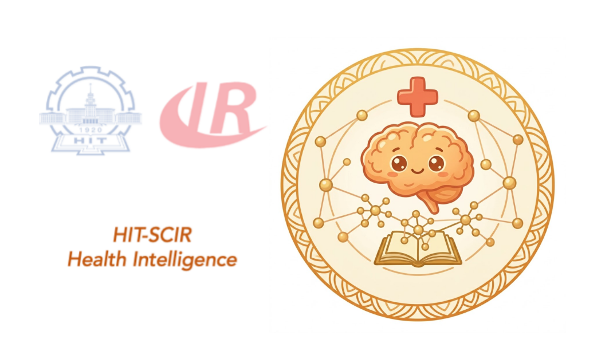
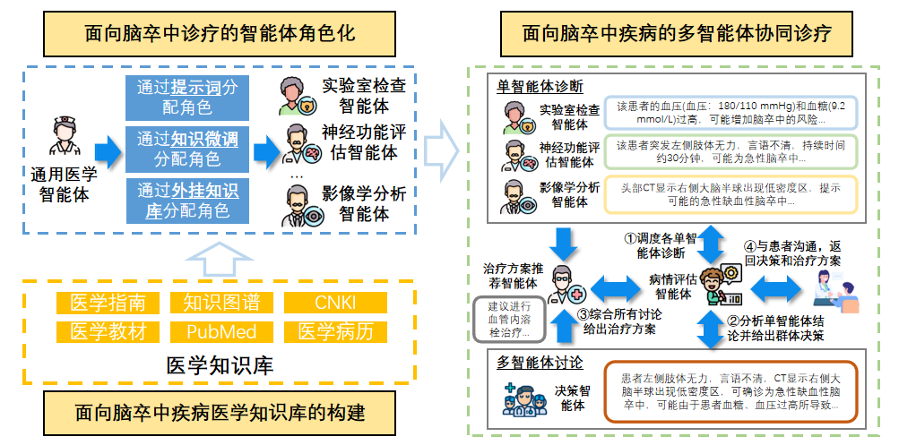
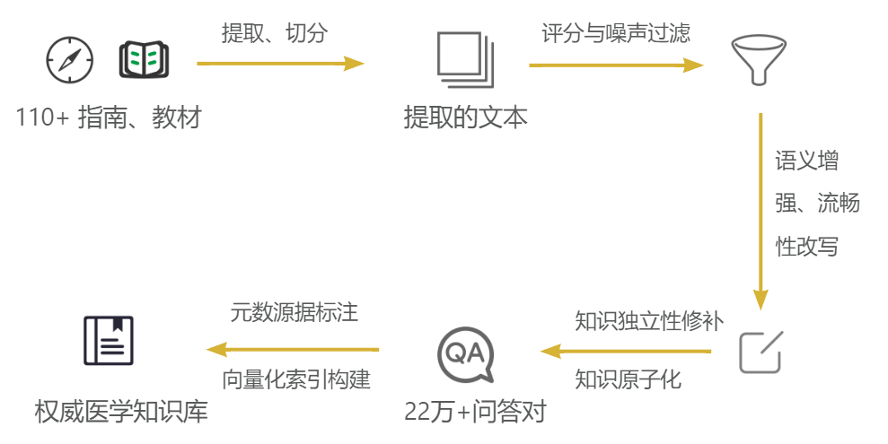
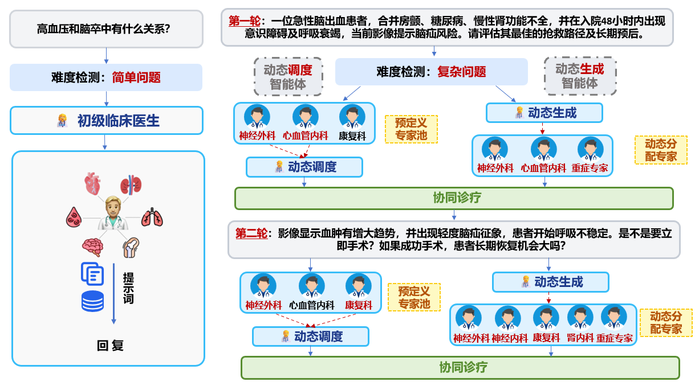
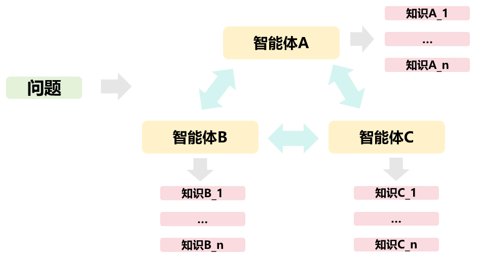

# Knowledge-Enhanced Multi-Agent Medical AI System

> 面向医学问答、复杂临床推理与多专家协作决策的知识增强多智能体 AI 诊疗系统。




本项目开源了一个 **知识增强的多智能体医学推理系统**，面向脑血管病等医学垂直领域场景，结合高质量医学知识库、领域检索模型、多专家 Agent 协作和最终决策汇总机制，用于支持医学问答、临床推理、诊疗路径分析和医学知识增强型对话系统研究。


> 免责声明：本项目主要用于科研、教学、医学问答系统原型验证与多智能体协作机制研究，不构成真实临床诊断或治疗建议。任何医疗决策均应由具备资质的临床医生结合患者实际情况做出。

---

## 核心亮点

### 1. 面向医学场景的知识增强能力

系统并非直接依赖大语言模型的参数化知识回答医学问题，而是构建了一个面向脑血管病垂直领域的高质量医学知识库，并通过检索增强生成机制为模型提供外部知识支持。

知识增强部分包括：

- **权威医学资料解析**：从指南、教材和专家共识等来源构建领域知识库。
- **LLM 辅助知识清洗**：使用大语言模型对原始文本块进行医学价值评分，过滤目录、参考文献、页眉页脚、解析错误等低价值内容。
- **语义增强与知识修补**：通过大模型润色切片内容、补全指代、省略和上下文缺失，使知识条目脱离原文后仍具备完整语义。
- **知识原子化**：将段落级知识拆解为多角度问答对，并进一步转化为独立陈述句，提升向量检索的精确度。
- **领域检索模型训练**：利用大模型表征与教师 Reranker 打分构造困难负样本，训练脑卒中领域 Reranker 用于检索知识。

最终系统可将用户问题、专家视角和原子化医学知识进行结合，为多智能体推理提供可检索、可引用、可扩展的医学知识基础。

---

### 2. 动态多智能体医学协作

系统不是固定模板式问答，而是根据医学问题动态构建专家团队。对于简单问题，系统可由基础医学分析 Agent 直接回答；对于中等或困难问题，系统会自动进入多智能体协作流程。

多智能体部分包括：

- **问题难度自动评估**：判断问题属于简单、中等或困难任务。
- **动态专家招募**：由大模型根据问题内容自动生成专家角色，例如神经内科医生、影像科医生、临床药师、感染科医生等。
- **专家层级结构生成**：自动构建专家之间的协作关系，而不是简单平铺式投票。
- **主智能体统一问题拆解**：主智能体把原始问题拆成互补的原子医学问题，并将每个子问题匹配给最合适的从智能体。
- **三路改写 RAG 检索**：每个子问题生成 3 个互补检索表达，分别检索、合并和去重，再将“子问题 + 改写 + 知识”作为结构化任务包发送给从智能体。
- **多轮专家讨论**：专家可以相互提问、补充、反驳和修正观点。
- **最终决策汇总**：最终决策 Agent 综合所有专家结论，生成面向用户的最终医学回答。

---

### 3. 从知识库构建到诊疗推理的完整闭环

本项目的特点不是单独实现一个 RAG 模块或一个 Agent 框架，而是将二者连接成完整系统：

```text
医学资料
  ↓
文档解析与清洗
  ↓
LLM 知识增强与原子化
  ↓
向量知识库构建
  ↓
领域 Reranker 训练
  ↓
专家角色化检索
  ↓
多智能体协作推理
  ↓
最终诊疗建议汇总
```

这一闭环使系统具备三方面优势：

1. **知识更可靠**：回答不只依赖模型记忆，而是结合外部医学知识库。
2. **推理更全面**：不同专家从不同专业角度分析同一问题。
3. **过程更可解释**：系统可展示难度判断、专家招募、知识检索、专家讨论和最终决策过程。

---

## 系统整体流程

```text
用户医学问题
    │
    ▼
问题难度评估
    │
    ├── 简单问题
    │       └── 基础医学分析 Agent 直接回答
    │
    └── 中等 / 困难问题
            │
            ▼
      动态专家招募
            │
            ▼
      专家层级结构解析
            │
            ▼
      初始化专家 Agent 团队
            │
            ▼
      主智能体统一问题拆解
            │
            ▼
      子问题匹配从智能体
            │
            ▼
      每个子问题生成 3 个检索改写
            │
            ▼
      三路向量检索、合并与去重
            │
            ▼
      子问题 + 知识结构化派发
            │
            ▼
      并发生成专家初步意见
            │
            ▼
      医学助理阶段性总结
            │
            ▼
      多轮专家讨论与观点修正
            │
            ▼
      并发收集专家最终观点
            │
            ▼
      最终决策者综合判断
            │
            ▼
         最终医学回答
```

---

## 知识增强模块概览

### 医学知识库构建


项目支持从原始 PDF 医学资料构建向量知识库。当前流程面向脑血管病领域，使用权威指南、医学教材和专家共识作为知识来源。

知识库构建流程包括：

1. 使用文档解析工具将 PDF 转换为结构化 Markdown。
2. 使用滑动窗口方式对文档进行切片。
3. 使用 LLM 对切片进行医学价值评分，过滤低价值内容。
4. 对有效切片进行语义增强和流畅性改写。
5. 基于改写后的文本生成多角度 QA 对。
6. 将 QA 对转化为可独立理解的医学知识陈述句。
7. 为知识条目保留来源、章节、页码等元数据。
8. 使用 Embedding 模型向量化并构建 FAISS 索引。

### 检索模型训练

为提升医学领域检索效果，项目支持对 Reranker 模型进行领域微调。训练数据来自知识库构建过程中生成的问答对。

训练流程包括：

- 使用知识库 QA 构造 Query-Positive 样本。
- 使用粗召回获得候选负样本。
- 依赖更强的教师 Reranker 或大模型表征进行困难负例筛选。
- 构造 `1 个正例 + 多个困难负例` 的训练组。
- 使用 Listwise CrossEntropy 排序目标训练 Cross-Encoder Reranker。

---

## 模型与数据发布说明

本 GitHub 仓库仅发布系统源码、接口实现、文档和示意图，不直接托管模型权重、向量索引或医学数据文件。

本项目依赖的 Reranker 权重和 FAISS 知识库已通过 Hugging Face 单独发布：

| 资源类型 | 内容 | 发布位置 |
| --- | --- | --- |
| Reranker 权重 | 医学领域微调后的 Cross-Encoder Reranker | https://huggingface.co/literary123/test_encoder_only_base_bge-reranker-base-noscore_qwen_distill2 |
| 向量知识库 | FAISS 索引、知识条目元数据、处理后的知识片段 | https://huggingface.co/datasets/literary123/faiss_index_A_v4 |

由于医学资料可能涉及版权、授权和合规要求，GitHub 仓库不直接托管权重、索引或医学数据文件。使用时请先从 Hugging Face 下载 FAISS 知识库到本地，再将 `config.py` 中的 `FAISS_INDEX_PATH` 指向本地目录。

---

## 多智能体模块概览


### 动态专家招募


系统会根据当前问题自动生成医学专家团队，而不是预设固定专家列表。例如：

```text
问题：一名疑似急性脑卒中患者近期服用抗凝药，现在是否适合溶栓？

可能招募的专家：
1. 神经内科医生：关注卒中诊断、发病时间窗、NIHSS 评分、溶栓适应证。
2. 影像科医生：关注 CT/MRI 是否排除出血、是否存在大面积梗死。
3. 临床药师：关注抗凝药使用、凝血指标、出血风险和用药禁忌。
```

### 角色化检索


不同专家不会使用完全相同的检索查询。主智能体先统一拆分原始问题并完成“子问题—专家”匹配；随后系统为每个子问题生成 3 个互补的检索改写，分别检索医学知识。检索结果合并去重后，会连同对应子问题一起发送给被分配的从智能体。

```text
神经内科医生：
- 急性缺血性卒中的静脉溶栓时间窗是什么？
- NIHSS 评分如何影响溶栓决策？
- 哪些临床表现提示溶栓禁忌？

临床药师：
- 近期使用 DOAC 是否影响静脉溶栓？
- 抗凝药末次服药时间如何影响出血风险？
- 溶栓前应检查哪些凝血指标？
```

这样可以让不同专家获得差异化知识上下文，提高最终回答的覆盖度和专业性。

### 多轮讨论与最终决策

专家完成初步分析后，系统会组织多轮讨论。专家可以选择是否参与当前回合，并指定希望交流的对象。讨论结束后，系统并发收集各专家的最终观点，再由最终决策 Agent 汇总。

---

## 技术架构

```text
┌──────────────────────────────────────────┐
│              FastAPI Server              │
│       普通问答接口 / SSE 流式接口          │
└──────────────────┬───────────────────────┘
                   │
                   ▼
┌──────────────────────────────────────────┐
│             Agent Orchestrator            │
│   难度评估 / 专家招募 / 讨论调度 / 决策汇总 │
└──────────────────┬───────────────────────┘
                   │
       ┌───────────┴───────────┐
       ▼                       ▼
┌───────────────┐       ┌──────────────────┐
│ Medical Agents│       │  Retrieval Engine │
│ 专家角色推理   │       │  FAISS + Reranker │
└───────────────┘       └──────────────────┘
       │                       │
       └───────────┬───────────┘
                   ▼
┌──────────────────────────────────────────┐
│        Knowledge-Enhanced Reasoning       │
│       角色化知识检索 + 多专家综合推理       │
└──────────────────────────────────────────┘
```

---

## 主要模块

```text
.
├── config.py          # 全局配置：模型、服务、检索、生成参数、CORS 与会话参数
├── utils.py           # Agent 封装、LLM 调用、流式输出、难度评估
├── retriever.py       # 医学知识检索、子问题三路改写、合并去重、重排
├── md_agent.py        # 动态专家招募、多专家讨论、最终决策汇总
├── multi_agent.py     # FastAPI 服务入口、普通接口、流式接口、会话管理
├── one_agent.py       # 简单问题处理逻辑
├── med_agent.py       # 中等复杂度问题处理逻辑
├── test.py            # 本地测试脚本
├── doc/
│   └── TECHNICAL_DESIGN_Knowledge_Enhanced_MultiAgent_Medical_AI.md
│       # 技术设计文档、系统白皮书和开发者说明
└── medrag_pipeline/   # 知识库构建与检索模型训练流程
```

---

完整技术实现说明见 [doc/TECHNICAL_DESIGN_Knowledge_Enhanced_MultiAgent_Medical_AI.md](doc/TECHNICAL_DESIGN_Knowledge_Enhanced_MultiAgent_Medical_AI.md)。相比 README，该文档更偏向系统架构、知识库构建、检索模型训练、多智能体协作机制和服务接口实现，可作为系统白皮书或开发者文档使用。

### 母版恢复

本次主从智能体流程改造前的母版位于：

```text
backups/master_before_main_subagent_pipeline_20260717_220206/
```

可在项目根目录使用以下 PowerShell 命令恢复本次修改涉及的母版文件：

```powershell
powershell -ExecutionPolicy Bypass -File ".\backups\master_before_main_subagent_pipeline_20260717_220206\restore.ps1"
```

---

## 快速开始

### 1. 创建环境

```bash
conda create -n medical-agent python=3.10
conda activate medical-agent
```

### 2. 安装依赖

```bash
pip install fastapi uvicorn openai
pip install torch transformers
pip install langchain langchain-community
pip install faiss-cpu
pip install pydantic tqdm termcolor prettytable pptree regex
```

如需使用 GPU 版 FAISS，可根据 CUDA 环境安装对应版本。

### 3. 配置线上 Qwen3-32B

所有大语言模型调用都通过 OpenAI-compatible 接口访问线上 `Qwen3-32B`。API Key 只从环境变量读取，请勿写入代码或提交到 Git。

Windows PowerShell：

```powershell
$env:MODAGENT_API_KEY="<YOUR_API_KEY>"
```

Linux / macOS：

```bash
export MODAGENT_API_KEY="<YOUR_API_KEY>"
```

默认配置已经指向以下接口和模型，一般不需要再设置：

```text
LLM_BASE_URL=https://api.modagent-homing.com/v1
LLM_MODEL=Qwen3-32B
```

如果服务地址或模型名发生变化，可通过同名环境变量覆盖。客户端默认请求超时为 180 秒、失败重试 3 次，也可通过 `LLM_TIMEOUT_SECONDS` 和 `LLM_MAX_RETRIES` 调整。

卒中相关问题默认启用第二阶段硬约束招募：模型只推荐专家 ID，程序再依据
`skills/medical-multi-agent/experts.json` 完成白名单校验、固定 Prompt 绑定和失败回退；
非卒中问题仍使用原通用招募流程。如需临时回退旧行为，可在启动后端前设置：

```bash
export STROKE_HARD_RECRUITMENT_ENABLED=false
```

修改专家库位置时可设置 `STROKE_EXPERT_REGISTRY_PATH`。配置或代码修改后需要重启
后端进程（使用自动重载模式时除外）。

先运行最小连通性测试：

```bash
python test_qwen_api.py
```

### 4. 配置本地检索资源

线上 Qwen3-32B 只替代项目中的大语言模型生成部分。Embedding、Reranker 和 FAISS 知识库仍在本地运行；请先下载相应资源，再修改 `config.py` 中的路径：

```python
EMBEDDING_MODEL = "/path/to/bge-m3"
RERANK_MODEL = "literary123/test_encoder_only_base_bge-reranker-base-noscore_qwen_distill2"
FAISS_INDEX_PATH = "/path/to/faiss_index_A"
```

### 5. 启动后端服务

```bash
python multi_agent.py
```

默认服务地址：

```text
http://0.0.0.0:50042
```

### 6. 启动决策可视化前端

项目提供了一个无需构建的 Web 前端，用于实时展示专家招募、独立分析、协作辩论和最终决策过程：

```bash
python -m http.server 5173 --directory frontend
```

浏览器访问 `http://127.0.0.1:5173`。前端默认连接
`http://127.0.0.1:50042/chat/stream`，也可以在页面右上角修改接口地址。
未启动后端时，可使用页面内的演示回放。

---

## Trace2Skill 离线技能进化

项目已将 [Qwen-Applications/Trace2Skill](https://github.com/Qwen-Applications/Trace2Skill)
固定在 `third_party/Trace2Skill`，仅用于离线生成候选技能。在线请求会加载
`skills/medical-multi-agent` 中已经审核的技能，但不会在请求过程中运行 Trace2Skill，
也不会自动发布模型生成的修改。

默认关闭轨迹记录。测试或人工审核环境可启用仅哈希模式：

```powershell
$env:TRACE2SKILL_ENABLED="true"
$env:TRACE2SKILL_CAPTURE_CONTENT="false"
python multi_agent.py
```

只有在输入已脱敏且允许保存内容时，才设置
`TRACE2SKILL_CAPTURE_CONTENT=true`。当前脱敏器只覆盖手机号、邮箱和中国大陆身份证号等
高置信标识符，不能替代正式的数据脱敏流程。

将人工审核的 JSONL 转成 Trace2Skill 输入：

```powershell
python -m trace2skill_adapter.prepare_records `
  --input data\trace2skill\reviewed_cases.jsonl `
  --output data\trace2skill\parsed_error_records.json
```

创建隔离环境、安装离线依赖并先执行 dry-run：

```powershell
python -m venv third_party\Trace2Skill\.venv
third_party\Trace2Skill\.venv\Scripts\python.exe -m pip install -r requirements-trace2skill.txt
python -m trace2skill_adapter.run_evolution `
  --input-json data\trace2skill\parsed_error_records.json
```

包装器会自动优先使用 `third_party/Trace2Skill/.venv`，在线服务环境无需安装
`openpyxl`、`diskcache` 等离线依赖。

`--apply-to-candidate` 只会修改 `artifacts/trace2skill/candidates/` 下的隔离副本：

```powershell
python -m trace2skill_adapter.run_evolution `
  --input-json data\trace2skill\parsed_error_records.json `
  --apply-to-candidate
```

候选技能完成固定测试集和人工复核后，才允许显式发布：

```powershell
python -m trace2skill_adapter.promote_skill `
  --candidate-dir artifacts\trace2skill\candidates\<run-id>\medical-multi-agent `
  --approve
```

发布脚本会先备份当前在线技能。医疗事实、药物剂量和诊疗阈值仍应来自受控知识库或
人工维护内容；Trace2Skill 只用于进化工作流、检查清单和安全约束。

---

## API 示例

### 普通问答接口

```bash
curl -X POST "http://localhost:50042/chat" \
  -H "Content-Type: application/json" \
  -d '{
    "query": "较为常见视幻觉的痴呆类型是？A:帕金森痴呆，B:血管性痴呆，C:路易体痴呆，D:额颞叶痴呆，E:Alzheimer病",
    "id": "demo-session"
  }'
```

### 流式多智能体接口

```bash
curl -N -X POST "http://localhost:50042/chat/stream" \
  -H "Content-Type: application/json" \
  -d '{
    "query": "一名疑似急性脑卒中患者近期服用抗凝药，现在是否适合溶栓？请综合分析。",
    "id": "demo-session",
    "enableMultiAgent": true,
    "enableDifficultyAgent": false,
    "difficulty": "hard"
  }'
```

如需由难度评估智能体自动选择分析路径，可传入：

```json
{
  "enableDifficultyAgent": true,
  "difficulty": null
}
```

流式接口会返回难度评估、专家招募、专家输出、讨论过程和最终答案等事件，便于前端实时展示系统推理过程。

---

## 适用场景

- 医学问答系统原型研究
- 医学 RAG 系统构建
- 多智能体协作推理研究
- 临床决策支持系统探索
- 医学知识库构建与检索模型训练
- 医学教育、病例讨论和专家协作模拟

---

## 项目定位

本项目关注的是 **知识增强多智能体医学推理机制**，重点探索：

- 如何构建适合医学推理的高质量知识库；
- 如何训练更适合医学领域的检索模型；
- 如何让不同医学专家 Agent 基于角色化知识进行差异化推理；
- 如何通过多轮讨论提升复杂医学问题回答的全面性与稳定性。

---

## License

本项目建议采用 MIT License 开源。若知识库涉及受版权保护的教材、指南或专家共识，请在发布前确认数据来源、授权范围和分发方式。

---
## Contributor

本项目由哈尔滨工业大学SCIR实验室健康智能组杜晏睿、李家运、李文豪、马铭、赵丹杨完成，指导教师为赵森栋副教授，王昊淳副研究员，秦兵教授以及刘挺教授。


---

## Citation

如果本项目对你的研究或开发有帮助，欢迎引用或 Star 本仓库。

```bibtex
@misc{knowledge_enhanced_multiagent_medical_ai,
  title        = {Knowledge-Enhanced Multi-Agent Medical AI System},
  year         = {2026},
  howpublished = {Open-source project}
}
```
